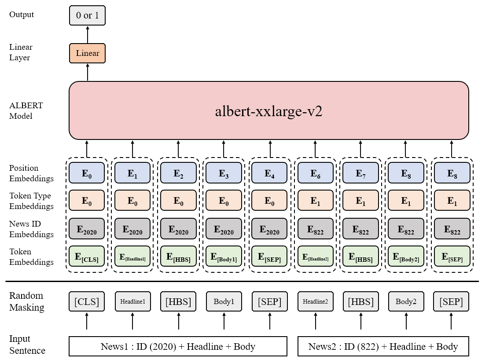

[Korean](README_KOR.md) | [English](README.md)
# Haafor Challenge 2020
The project for HAAFOR CHALLENGE 2020

## Challenge Information
**Finding the chronological order of articles**¹  

200,000 paris of articles will be provided. 

We encourage participants to develop an algorithm, which can analyze the relation between articles and figure out the chronological order of articles.

## Data Preprocessing

1. The total 200,000 data given as training data were divided as follows for hyper-parameter search.
    - Train : 190,000
    - Dev : 10,000
2. For the training set, the label was set to 0, and the entire training set was duplicated and the order of articles was changed, and the label was changed to 1.
    - Train : 380,000
        - Positive (Label : 0) : 190,000
        - Negative (Label : 1) : 190,000
3. For the development set, after random shuffle, 50% gave a label of 0, and the remaining 50% changed the order and gave a label of 1.
4. When submitting the actual `Answer.csv` after finding a suitable hyper-parameter, all data of 200,000 cases were used as the training set.

## Model
[Huggingface Transformers](https://github.com/huggingface/transformers)² was used to quickly implement and test the model.

As a result of testing various BERT models based on the dataset, `Albert` and `Electra` showed good performance.

Although `Sentence Order Prediction (SOP)`, one of the tasks in the pre-training process of `Albert`, is not suitable for the current task, `Albert` was chosen because it learns to understand the chronological order of sentences.

Pre-trained `Albert` provided by `Huggingface Transformers`² exists in various model sizes, but it was confirmed that the performance improved when the model size was increased, and the largest `albert-xxlarge-v2` was used.

Since the maximum length that `Albert' can use is 512, the sum of Article 1's Headline + Body and Article 2's Headline + Body exceeds 512, so we made the following assumptions and tried to solve them with the described method.
1. Any Article can exist in the first article because there is a process that changed the order before and after in the data preprocessing process.
2. If it exists in the first Article, Headline + Body can all be contained in 512 Tokens.
3. In that case, if I give an article's unique ID and add it as a feature, even if it is used as a second article and cut off, it has been used as the first article once, so model can grasp some information.
4. If ID Embedding is added to each Token rather than directly giving the ID Feature, the entire Embedding of Token is expressed differently for each Article, so it is determined that more information will be included in the important Token.
5. In the validation / test process, when an article that is first viewed appears, the ID of the article is assigned an ID corresponding to `[UNK]`.
6. In the above situation, in order to maintain the influence of ID Embedding, perform `Dynamic ID Masking` which randomly changes the ID to `[UNK]` at every step in the training process.
7. `Dynamic ID Masking` proceeds with a 15% probability, 40% of 15% is only for the first article, 40% for the second article, and the remaining 20% for the entire article.
  
As a result of the experiment, the above method showed a performance improvement of **1% ~ 2%** compared to when not used.

In addition, the test result Ensemble model performance improved by **1% ~ 2%**, so when submitting the actual `Answer.csv` result, 5 models were trained with different seeds and the Softmax value was ensembled and submitted.

The overall model is shown below.
\* Headline and Body contain several tokens.




## Hyper-parameters
```shell script
    --model albert-xxlarge-v2 \
    --seed 2020 \
    --save_total_limit 3 \
    --learning_rate 3e-5 \
    --per_device_train_batch_size 4 \
    --per_device_eval_batch_size 96 \
    --num_train_epochs 2.0 \
    --max_seq_length 512 \
    --eval_steps 125 \
    --logging_steps 13 \
    --save_steps 125 \
    --gradient_accumulation_steps 8 \
    --warmup_steps 500 \
    --fp16 \
    --fp16_opt_level O1 \
    --dynamic_doc_masking
```
For detailed hyper-parameters, please refer to the script file in the `sh` folder.

## Results

When evaluating dev based on the Hyper-parameters described above, it showed a performance of about 0.796.

When the weight decay was used as 0.0001, the performance improved to 0.806 when the seed was 2020, but the training was unstable in other seeds, so it was not used.

I will add the result of the test set as it comes out.

## Usage
```shell script
$ python utils/preprocessing.py

$ bash sh/train.sh
or
$ python main.py \
        --do_eval \
        --do_train \
        --do_predict \
        --evaluate_during_training \
        --output_dir data_out \
        --logging_dir data_out \
        --data_dir data_in \
        --cache_dir .cache \
        --overwrite_output_dir \
        --model albert-xxlarge-v2 \
        --seed 2020 \
        --save_total_limit 3 \
        --learning_rate 3e-5 \
        --per_device_train_batch_size 4 \
        --per_device_eval_batch_size 96 \
        --num_train_epochs 2.0 \
        --max_seq_length 512 \
        --eval_steps 125 \
        --logging_steps 13 \
        --save_steps 125 \
        --gradient_accumulation_steps 8 \
        --warmup_steps 500 \
        --fp16 \
        --fp16_opt_level O1 \
        --dynamic_doc_masking

```

To use the above Hyper-parameters, data must exist in the `data_in` folder. It also stores training results and logs in `data_out`.

## Requirements
In the case of `Apex`, you must install it directly from [NVIDIA-apex github](https://github.com/NVIDIA/apex)³, and for `torch`, it is recommended to use GPU version 1.6 or higher.
If you do not want to use `Apex`, you should remove the --fp16, --fp16_opt_level options at run time.
(`Tensorboard` is option)
```
apex==0.1
numpy==1.19.1
pandas==1.1.0
tensorboard==2.3.0
torch==1.6.0
torchvision==0.7.0
transformers==3.0.2
```

## Reference
¹[Haafor Challenge](https://www.haafor.com/challenge/)  
²[Huggingface Transformers](https://github.com/huggingface/transformers)  
³[NVIDIA-apex](https://github.com/NVIDIA/apex)